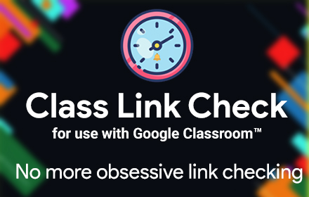
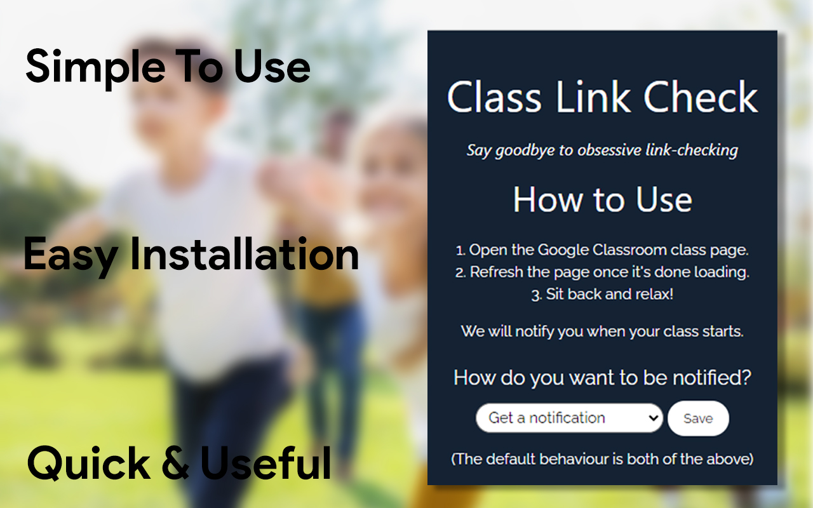

# Class Link Check for Google Classroom™

_Does your school use Google Classroom? Are you tired of having to check for the link before the class starts? Do you want to avoid spending your time waiting for class to start?_

Then **this** is the solution to your problems!

Class Link Check is an extension for your browser that automatically checks if the meeting link for the class has come. It even opens the class and alerts you to join it!

## How to Use:

1. Download the extension on our [website](https://arihant25.github.io/class-link-check/)

2. Before your class starts, open the Google Classroom page of your class and refresh it once again.

3. Sit back and relax while we handle the class link!

You can customize it by clicking on the extension. For example, you can decide whether to open the class when it starts, or to get a notification on your computer, or do both.

More features are coming very soon, like automatically choosing which account you want to use for your classes.

Download this extension today and make online classes fun again!

Class Link Check does not collect any personal information. It also does not transmit any data off your computer.
Google Classroom is a trademark of Google Inc. Use of this trademark is subject to Google Brand Permissions.
